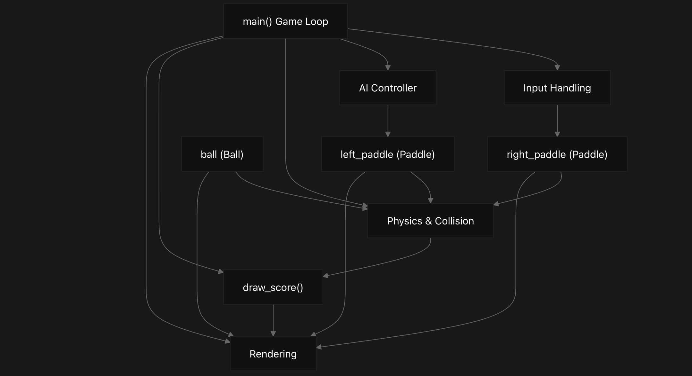
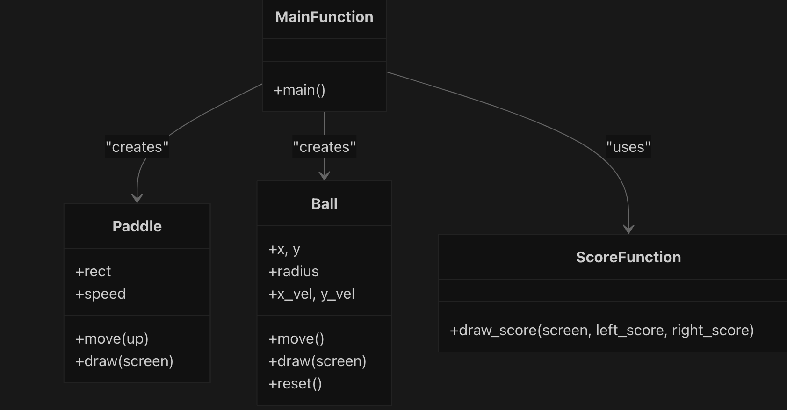
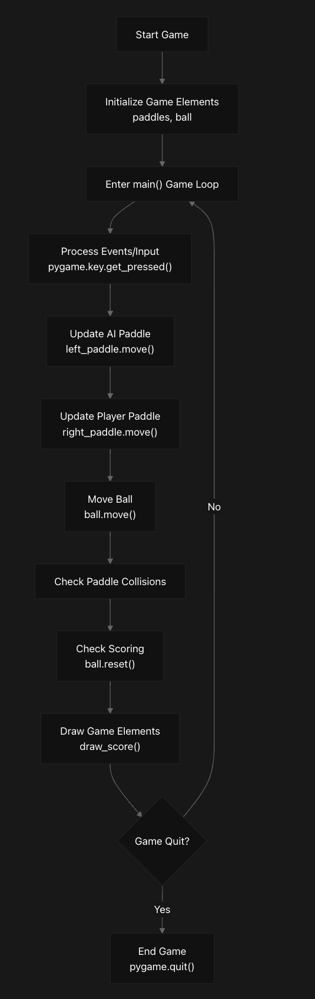
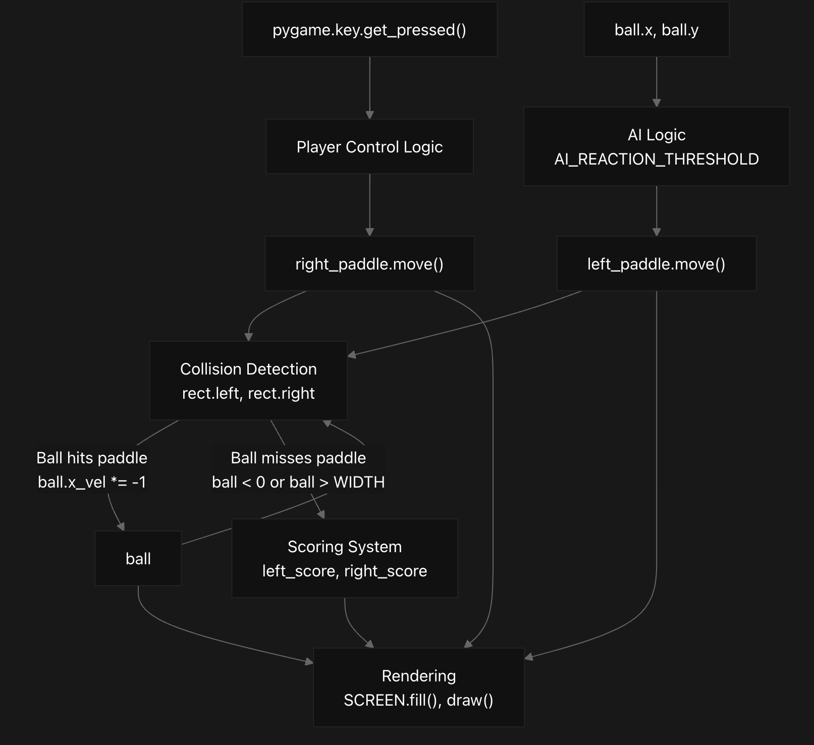
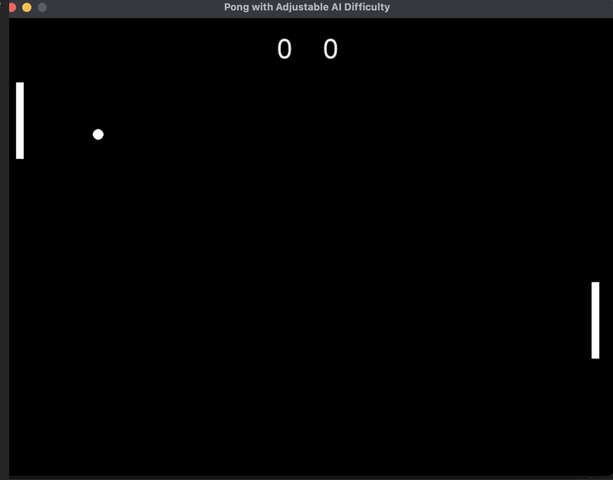

# pong_game 🏓
Pong game with adjustable AI difficulty coded in Python.  Runs locally.

# Overview
This document provides a comprehensive technical overview of the Pong game implementation in the repository. It covers the key components, architecture, and interactions between different game elements. For specific implementation details, see Game Implementation.

## Purpose and Scope
The pong_game repository implements a classic Pong arcade game using Pygame. This implementation features:

Player vs. AI gameplay

- Two-paddle system with ball physics and collision detection
- Keyboard-controlled right paddle and AI-controlled left paddle with adjustable difficulty
- Score tracking system
- Simple graphical user interface

The entire implementation is contained within a single Jupyter notebook (pong_game.ipynb), making it easily accessible and modifiable.

## System Architecture
The game follows a simple object-oriented architecture with distinct components handling different aspects of gameplay:

### System Component Diagram

## Key Components
The implementation consists of these essential components:

Component	Description	Source
Paddle Class	Manages paddle position, movement, and rendering	
pong_game.ipynb
55-73
Ball Class	Handles ball position, velocity, collision, and rendering	
pong_game.ipynb
75-98
Score System	Tracks and displays player scores	
pong_game.ipynb
100-104
Main Game Loop	Orchestrates game flow and all component interactions	
pong_game.ipynb
106-175
AI Controller	Controls left paddle based on ball position	
pong_game.ipynb
126-131
Sources: 
pong_game.ipynb
30-175

## Game Classes
### Class Structure Diagram

## Game Flow
The game follows a standard game loop pattern as illustrated below:

### Game Loop Flowchart

## Component Interactions
The following diagram illustrates how the different components interact during gameplay:

### Component Interaction Diagram

## Game Configuration
The game includes these configurable parameters:

Parameter	Value	Description	Source
Screen Size	800x600	Game window dimensions	
pong_game.ipynb
37-39
FPS	60	Frames per second for game timing	
pong_game.ipynb
47
Paddle Size	10x100	Width x height of each paddle	
pong_game.ipynb
48
Ball Radius	7	Size of the ball	
pong_game.ipynb
49
Player Speed	5	Movement speed of player paddle	
pong_game.ipynb
57
AI Speed	4	Movement speed of AI paddle	
pong_game.ipynb
52
AI Reaction Threshold	15	Pixels before AI starts moving	
pong_game.ipynb
53
Sources: 
pong_game.ipynb
37-53

### Technical Components
The implementation utilizes these technical components:

Python 3.12.3: Core programming language
Pygame: Library for handling graphics, input, and timing
Jupyter Notebook: Development environment containing the implementation
Sources: 
pong_game.ipynb
31
 
pong_game.ipynb
213

# Code Notebook
Run this code to launch game
    
    import pygame
    import sys
    
    # Initialize Pygame
    pygame.init()
    
    # Screen dimensions
    WIDTH, HEIGHT = 800, 600
    SCREEN = pygame.display.set_mode((WIDTH, HEIGHT))
    pygame.display.set_caption('Pong with Adjustable AI Difficulty')
    
    # Colors
    WHITE = (255, 255, 255)
    BLACK = (0, 0, 0)
    
    # Game settings
    FPS = 60
    PADDLE_WIDTH, PADDLE_HEIGHT = 10, 100
    BALL_RADIUS = 7
    
    # AI difficulty parameters
    AI_SPEED = 4          # Lower than player speed (5)
    AI_REACTION_THRESHOLD = 15  # Pixels before AI starts moving
    
    # Paddle class
    class Paddle:
        def __init__(self, x, y, speed=5):
            self.rect = pygame.Rect(x, y, PADDLE_WIDTH, PADDLE_HEIGHT)
            self.speed = speed

    def move(self, up=True):
        if up:
            self.rect.y -= self.speed
        else:
            self.rect.y += self.speed
        # Keep paddle on screen
        if self.rect.top < 0:
            self.rect.top = 0
        if self.rect.bottom > HEIGHT:
            self.rect.bottom = HEIGHT

    def draw(self, screen):
        pygame.draw.rect(screen, WHITE, self.rect)

    # Ball class
    class Ball:
        def __init__(self, x, y):
            self.x = x
            self.y = y
            self.radius = BALL_RADIUS
            self.x_vel = 4
            self.y_vel = 4

    def move(self):
        self.x += self.x_vel
        self.y += self.y_vel

        # Bounce off top and bottom
        if self.y - self.radius <= 0 or self.y + self.radius >= HEIGHT:
            self.y_vel *= -1

    def draw(self, screen):
        pygame.draw.circle(screen, WHITE, (int(self.x), int(self.y)), self.radius)

    def reset(self):
        self.x = WIDTH // 2
        self.y = HEIGHT // 2
        self.x_vel *= -1  # Send ball back to scorer

    # Draw current score
    def draw_score(screen, left_score, right_score):
        font = pygame.font.SysFont('Arial', 36)
        score_text = font.render(f"{left_score}    {right_score}", True, WHITE)
        screen.blit(score_text, (WIDTH // 2 - score_text.get_width() // 2, 20))
    
    # Main game loop
    def main():
        clock = pygame.time.Clock()

    # Initialize paddles and ball
    left_paddle = Paddle(20, HEIGHT // 2 - PADDLE_HEIGHT // 2, speed=AI_SPEED)
    right_paddle = Paddle(WIDTH - 20 - PADDLE_WIDTH, HEIGHT // 2 - PADDLE_HEIGHT // 2)
    ball = Ball(WIDTH // 2, HEIGHT // 2)

    left_score = 0
    right_score = 0
    running = True

    while running:
        clock.tick(FPS)
        for event in pygame.event.get():
            if event.type == pygame.QUIT:
                running = False

        keys = pygame.key.get_pressed()
        # AI controls left paddle with reaction threshold
        if abs(left_paddle.rect.centery - ball.y) > AI_REACTION_THRESHOLD:
            if left_paddle.rect.centery < ball.y:
                left_paddle.move(up=False)
            else:
                left_paddle.move(up=True)

        # Player controls right paddle
        if keys[pygame.K_UP]:
            right_paddle.move(up=True)
        if keys[pygame.K_DOWN]:
            right_paddle.move(up=False)

        # Move ball
        ball.move()

        # Check paddle collisions and adjust position to avoid sticking
        # Left paddle collision
        if (ball.x - ball.radius <= left_paddle.rect.right and
            left_paddle.rect.top < ball.y < left_paddle.rect.bottom):
            ball.x_vel *= -1
            ball.x = left_paddle.rect.right + ball.radius
        # Right paddle collision
        if (ball.x + ball.radius >= right_paddle.rect.left and
            right_paddle.rect.top < ball.y < right_paddle.rect.bottom):
            ball.x_vel *= -1
            ball.x = right_paddle.rect.left - ball.radius

        # Check scoring
        if ball.x < 0:
            right_score += 1
            ball.reset()
        if ball.x > WIDTH:
            left_score += 1
            ball.reset()

        # Draw everything
        SCREEN.fill(BLACK)
        left_paddle.draw(SCREEN)
        right_paddle.draw(SCREEN)
        ball.draw(SCREEN)
        draw_score(SCREEN, left_score, right_score)

        pygame.display.flip()

    pygame.quit()
    sys.exit()

    if __name__ == '__main__':
        main()

